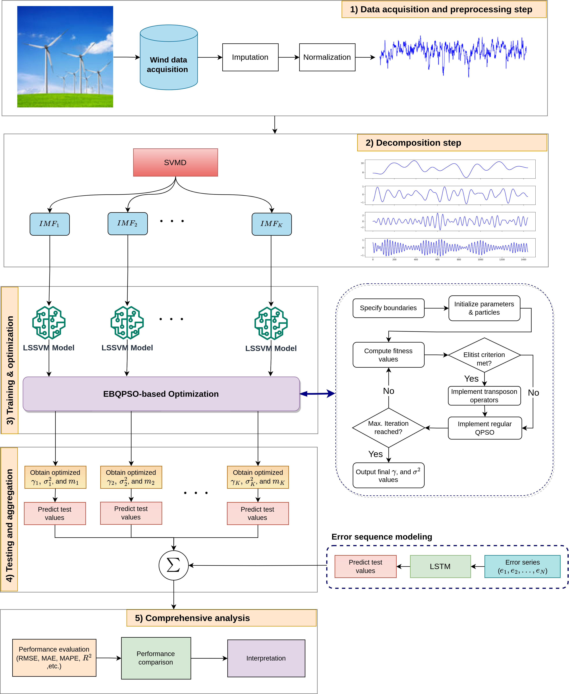

## Short term wind speed forecasting
This is part of our paper published in Arxvi. Wind pwoer is one of the most important renewable energy resources. In this work, we propose a QPSO with elitist breeding (EBQPSO) optimization algorithm to tune parameters of LSSVM and LSTM.

The overall diagram of the methodology of this work is given below:

